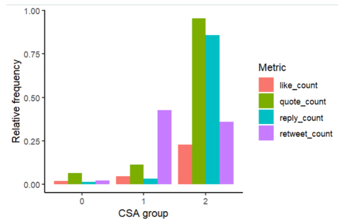

# 🐦 Social vs Political Brand Activism

**Tools:** R, Twitter API, Regression Analysis  
**Date:** 2023  
**Type:** Social Media Analytics  

---

##  Project Overview

Click to expand

In recent years, **corporate social advocacy (CSA)** — brands openly expressing opinions on sensitive topics — has intensified. While most research considers CSA generally, practice shows that brands often focus on narrower topics:  

- **Social CSA example:** Black Lives Matter  
- **Political CSA example:** Pension indexation debate in France  

The research objective: determine whether **social media engagement** differs depending on whether the CSA message is political or social.  

**Impact:** The findings help marketers and content managers select messages that maximize **positive social engagement**.

---

##  Methodology Overview

Click to expand

The research followed a **semantic analysis + regression modeling** approach:  

1. **Manual Coding & Training Sample**  
   - Randomly extracted 9,931 tweets  
   - Coded according to context:  
     - `1` → Social CSA  
     - `2` → Political CSA  
     - `0` → No CSA context  

2. **Data Preprocessing**  
   - **Normalization & Cleaning** using R (`text2vec`):  
     - Remove URLs, user mentions, hashtags, punctuation, special characters, RTs, numbers, emojis  
     - Lowercase text, remove whitespace, lemmatization, remove stopwords  
   - **Tokenization** → split text into individual words  
   - **Vectorization** → Document-Term Matrix (DTM)  
   - **Feature Transformation** → TF-IDF weighting  

3. **Machine Learning Classification**  
   - **Multinomial Logistic Regression** with `glmnet` in R  
   - Training set: 80%, Test set: 20%  
   - Cross-validation with 3 folds  
   - Hyperparameter α = 1 (Laplace smoothing)  
   - Evaluation: MAE = 0.0418, MSE = 0.048 → classifier performed well despite unbalanced data  

4. **Prediction**  
   - Classifier applied to remaining 102,938 tweets:  
     - Social CSA: 4,424 tweets  
     - Political CSA: 303 tweets  

5. **Qualitative Validation**  
   - Word clouds generated to visualize most frequent words per category
 

Click to view visual proof

---

## Results & Visualizations

Click to expand

### 1️⃣ Engagement Overview

- **Dependent variable:** `Engagement` — the sum of likes, replies, quotes, and shares.  
- Distribution is highly right-skewed → most tweets have low engagement.  
- Scatterplots showed:  
  - Most data points belong to the group **without CSA**.  
  - Each group exhibits its **own engagement pattern**: higher engagement corresponds to fewer tweets.  

**Visualization:**  

  
*Figure 1: Distribution of total engagement per tweet*

---

### 2️⃣ Violin & Boxplots

- **Violin plots with embedded boxplots** were created for two main groups:  
  - Social CSA  
  - Political CSA  

**Key observations:**  
- Data distribution differs between the two groups.  
- Tweets with political context show **higher density at large engagement values**.  
- Median: political CSA < social CSA  
- Range: political CSA > social CSA  

**Visualization:**  

  
*Figure 2: Violin plot of engagement for social vs political CSA*

---

### 3️⃣ Statistical Testing

- **Variance check:** unequal → used **non-parametric test**  
- **Kruskal-Wallis test:** p-value = 0.005075 < 0.05 → statistically significant differences between groups

---

### 4️⃣ Regression Analysis

- **Data characteristics:** count data with strong over-dispersion → ordinary linear models are not suitable  
- **Chosen model:** Negative Binomial (NB) Regression  

**Over-dispersion check:**  
- Variance / Mean = 179,379 → much greater than 1 → NB regression justified  

**Model formula:** Engagement ~ CSA context + Time controls (year, month, time of day)  

**NB regression results (summary):**  
 

**Differences by engagement type:**  
 

- **Conclusion:** Coefficients differ in magnitude and direction → groups significantly differ in their impact on engagement.  
- **Model evaluation:** AIC = 117,792, BIC = 1,178,118 → best among four tested models

---

## Discussion + Key Takeaways

Click to expand

### 1️⃣ Research Insights

- **Corporate Social Advocacy (CSA)** — brands publicly taking a stance on controversial topics like racism or inclusivity — is increasingly demanded by audiences (Moorman 2020; Sandler 2020).  
- While CSA has been studied broadly, **little is known about how different types of CSA (social vs political) impact social media engagement**.  
- Analysis of ~103,000 tweets from 87 brands revealed **significant differences in audience engagement**:  
  - **Political CSA** → higher engagement (quotes, replies, retweets)  
  - **Social CSA** → generally negative impact on engagement metrics, except for a slight positive effect on retweets  
- **No CSA content** often shows strong positive engagement across metrics, except for quotes where political CSA dominates  

---

### 2️⃣ Hypotheses Tested

1. **H1:** Engagement differs depending on the type of CSA (political or social)  
   - ✅ Supported: NB regression shows significant differences (p < 0.05)  
2. **H2:** Social CSA receives more engagement than political CSA  
   - ❌ Rejected: Social CSA had a negative effect, while political CSA significantly increased user activity  

---

### 3️⃣ Detailed Patterns

- Political CSA tweets drive **more quotes and replies**  
- Social CSA tweets generate **more retweets**, but lower engagement elsewhere  
- Regression models per engagement metric confirmed:  
  - **Social CSA** → strongest negative effect on likes  
  - **Political CSA** → strongest positive effect on quotes and retweets  
  - **No CSA** → strong positive impact overall, except for quotes  

**Visualization examples:**   

  
*Figure: Engagement metrics in relative frequency for accurate comparison*

---

### 4️⃣ Managerial Implications

1. **Engagement Matters:**  
   - Prioritize **political CSA topics** in social media strategy to maximize engagement.  
   - Monitor the **quality and sentiment** of engagement to avoid negative brand impact.  

2. **Strategic Consideration:**  
   - Carefully evaluate **social CSA topics**, as they may result in negative engagement.  
   - Ensure alignment with brand values and prepare mitigation strategies for potential backlash.  

3. **The Reputation Compass:**  
   - Predict audience reactions using historical data.  
   - Prepare contingency plans for political CSA content, as higher engagement may still involve negative feedback.  

